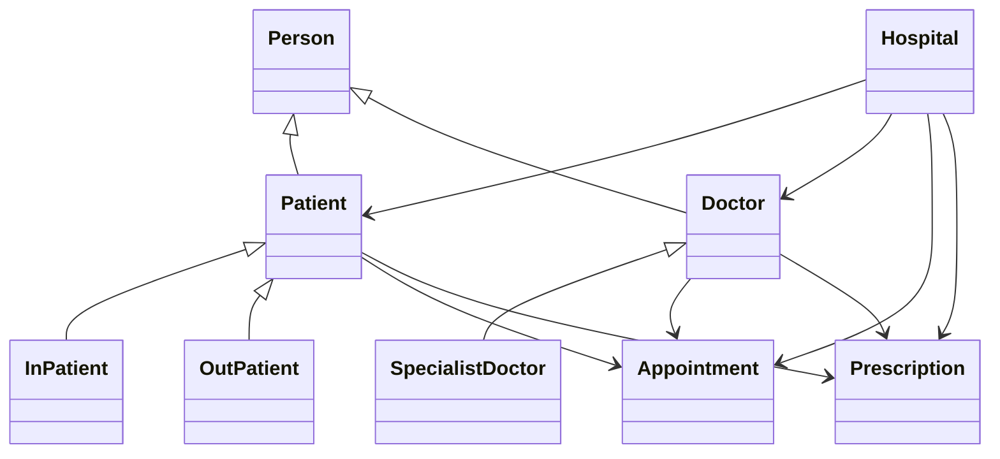

# Hospital Patient Management System

A simple object-oriented hospital management system that supports inpatient and outpatient billing, doctor management, appointment booking, prescriptions, and JSON persistence.

## Features

- InPatient and OutPatient classes with insurance-aware billing
- Doctor and SpecialistDoctor classes with polymorphic display
- Appointment class for structured appointment data
- Prescription class for medication tracking
- Hospital class with automatic JSON load/save for patients, doctors, appointments, and prescriptions
- Text-based main menu for adding patients, doctors, booking appointments, and displaying bills

## Requirements

- Python 3.8 or newer
- No external Python packages required

## Class Diagram


## Setup

1. Install Python 3.8+ if needed.
2. (Optional) Create a virtual environment:
   ```bash
   python -m venv venv
   source venv/bin/activate  # Windows: venv\Scripts\activate
   ```
3. Install dependencies:
   ```bash
   pip install -r requirements.txt
   ```

## Run

```bash
python main.py
```

Use the numbered menu to add inpatients, outpatients, doctors, book appointments, and view bills.

## Persistence

The application stores data in JSON files automatically:

- `patients.json`
- `doctors.json`
- `appointments.json`
- `prescriptions.json`

These files are loaded on startup and saved on exit.

## Testing

Run unit tests with:

```bash
python -m unittest discover -s . -p "test_*.py"
```
